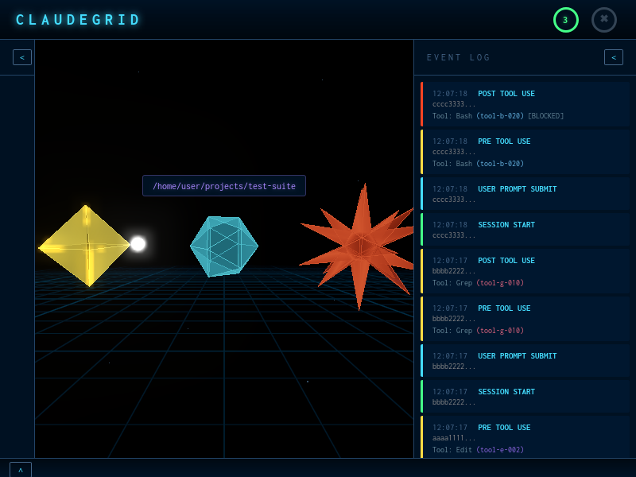

# ClaudeGrid

A real-time 3D visualizer for Claude Code session activity, inspired by Bit, from Tron.

ClaudeGrid transforms your Claude Code sessions into an immersive, cyberpunk-style visualization. Watch as Claude processes your prompts, executes tools, and spawns subagents — all rendered as glowing geometric "Bits" that morph, pulse, and shatter in response to live events.



## Features

- **Real-time visualization** — Live WebSocket connection streams Claude Code events as they happen
- **3D animated characters** — Each session is represented as a glowing geometric "Bit" rendered with Three.js
- **Visual state feedback** — Bits change color and shape based on activity, just like in the movie:
  - Cyan icosahedron: Idle/neutral state
  - Fast-spinning cyan: Processing your prompt
  - Yellow octahedron: Successful tool execution
  - Red starburst: Blocked/failed tool execution
  - Shatter particles: Session ending
- **Subagent hierarchy** — Child agents orbit around their parent sessions
- **Event log sidebar** — Detailed activity feed with timestamps and tool details
- **Procedural audio** — Optional synthesized sound effects (Tone.js)
- **Post-processing effects** — Bloom/glow shaders for that authentic neon aesthetic

## Requirements

- Node.js 18+
- Claude Code CLI with hooks support

## Quick Start

```bash
# Clone and install
git clone https://github.com/yourusername/claudegrid.git
cd claudegrid
npm install

# Install Claude Code hooks
npm run install-hooks

# Start the visualizer
npm start
```

Open http://localhost:3333 in your browser, then start using Claude Code.

## UI Controls

- **Sound toggle** — Enable/disable audio feedback
- **Clear log** — Clear the event log sidebar
- **Collapse panels** — Toggle sidebar visibility

## Installation

### 1. Install dependencies

```bash
npm install
```

### 2. Install Claude Code hooks

The hook installation script modifies your `~/.claude/settings.json` to send events to ClaudeGrid:

```bash
npm run install-hooks
```

To uninstall hooks later:

```bash
node hooks/install.js --uninstall
```

### 3. Start the server

```bash
npm start
```

The server runs on port 3333 by default. Open http://localhost:3333 in a browser.

## Configuration

### Environment Variables

| Variable | Default | Description |
|----------|---------|-------------|
| `CLAUDEGRID_PORT` | `3333` | Server port |
| `CLAUDEGRID_URL` | `http://localhost:3333` | URL used by hooks to send events |

### Example

```bash
CLAUDEGRID_PORT=8080 npm start
```

## Architecture

```
claudegrid/
├── bin/
│   └── claudegrid.js          # CLI entry point
├── client/
│   ├── index.html             # Main page
│   ├── styles.css             # Tron-themed styling
│   └── js/
│       ├── main.js            # App orchestrator
│       ├── SessionGrid.js     # Three.js scene & layout
│       ├── BitVisualizer.js   # 3D Bit rendering
│       ├── AudioManager.js    # Tone.js sound effects
│       └── EventLog.js        # Activity log sidebar
├── server/
│   ├── index.js               # Express + WebSocket server
│   └── SessionManager.js      # Session state management
├── hooks/
│   ├── install.js             # Hook installer
│   └── claudegrid-hook.sh     # Event posting script
└── docs/
    └── claude_hooks.md        # Hook reference
```

## API Reference

### HTTP Endpoints

#### `POST /api/events`

Receives Claude Code hook events.

**Request body:**
```json
{
  "event": "PreToolUse",
  "sessionId": "abc123",
  "parentSessionId": "def456",
  "toolName": "Edit",
  "data": { ... }
}
```

**Response:** `200 OK` with `{ "status": "ok" }`

#### `GET /api/sessions`

Returns the current session tree.

**Response:**
```json
{
  "abc123": {
    "sessionId": "abc123",
    "state": "NEUTRAL",
    "children": ["xyz789"]
  }
}
```

#### `GET /api/health`

Health check endpoint.

**Response:** `200 OK` with `{ "status": "healthy" }`

### WebSocket Messages

Connect to `/ws` for real-time updates.

**Server → Client messages:**

```json
{
  "type": "sessionEvent",
  "event": "PreToolUse",
  "sessionId": "abc123",
  "data": { ... }
}
```

```json
{
  "type": "fullState",
  "sessions": { ... }
}
```

## Hook Events

ClaudeGrid responds to these Claude Code lifecycle events:

| Event | Description | Visual Effect |
|-------|-------------|---------------|
| `SessionStart` | New session created | New Bit appears |
| `UserPromptSubmit` | User submitted a prompt | Bit enters thinking state |
| `PreToolUse` | Tool about to execute | Pulse animation |
| `PostToolUse` | Tool finished | Yes (success) or No (blocked) state |
| `Stop` | Main session stopped | Returns to neutral |
| `SubagentStop` | Subagent stopped | Returns to neutral |
| `SessionEnd` | Session terminated | Shatter animation, Bit removed |

## Development

### Running locally

```bash
npm start
```

The server watches for connections and serves the client from `client/`.

### Frontend libraries (via CDN)

- [Three.js](https://threejs.org/) v0.160.0 — 3D rendering
- [Tone.js](https://tonejs.github.io/) v14.7.77 — Audio synthesis

### Adding new visual states

1. Define the state in `client/js/BitVisualizer.js`:
   - Add geometry in `getGeometry()`
   - Add material color in `getMaterial()`
2. Handle the transition in `setState()`
3. Add server-side mapping in `server/SessionManager.js`

### Adding new hook events

1. Add event handling in `server/SessionManager.js` `processEvent()`
2. Add client-side handling in `client/js/main.js` `handleEvent()`
3. Add visual feedback in `BitVisualizer.js` if needed

## Troubleshooting

### No sessions appearing

1. Verify hooks are installed: check `~/.claude/settings.json` for ClaudeGrid hooks
2. Ensure the server is running on the expected port
3. Check browser console for WebSocket connection errors
4. Verify Claude Code is running with hooks enabled

### No sound

Sound requires a user interaction (click) to enable due to browser autoplay policies. Click the sound toggle or anywhere on the page to enable audio.

### Hook errors

If hooks fail silently, check that:
- The hook script is executable: `chmod +x hooks/claudegrid-hook.sh`
- `curl` is available on your system
- The `CLAUDEGRID_URL` environment variable is correct

### WebSocket disconnects

The client automatically reconnects with exponential backoff. If disconnects persist, check:
- Network connectivity
- Server logs for errors
- Firewall/proxy settings

## License

MIT License
