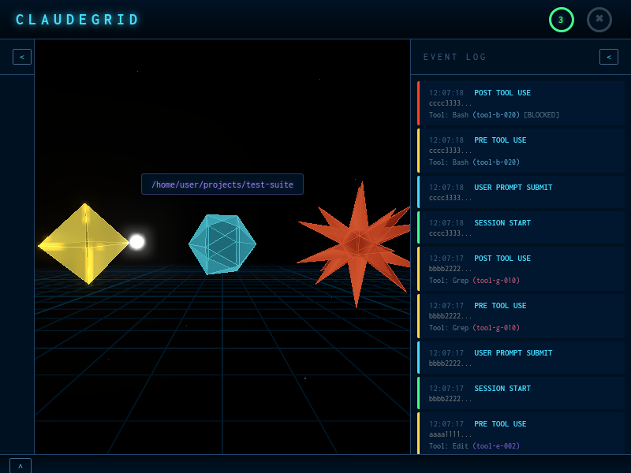

# ClaudeGrid

A real-time 3D visualizer and session manager for Claude Code, inspired by Bit from Tron.

ClaudeGrid transforms your Claude Code sessions into an immersive, cyberpunk-style visualization. Watch as Claude processes prompts, executes tools, and spawns subagents — all rendered as glowing geometric "Bits" that morph, pulse, and shatter in response to live events.

Beyond visualization, ClaudeGrid can create and manage Claude Code sessions via tmux, letting you send prompts, handle permissions, and monitor terminal output from the browser.



## Features

- **Real-time 3D visualization** — Live WebSocket connection streams Claude Code events as they happen, rendered with Three.js and bloom post-processing
- **Session management** — Create, monitor, and interact with Claude Code sessions backed by tmux
- **Two session types**:
  - **Managed sessions** — Created through ClaudeGrid with full tmux-backed control (prompt, cancel, restart)
  - **Observed sessions** — Automatically appear from hook events, visualization-only
- **Visual state feedback** — Bits change geometry, color, and rotation speed based on activity:
  - Cyan icosahedron (slow spin): Idle
  - Cyan icosahedron (fast spin): Thinking/processing
  - Yellow octahedron: Successful tool execution
  - Orange starburst: Blocked/failed tool execution
  - Shatter particles: Session ending
- **Subagent hierarchy** — Child agents orbit around their parent sessions
- **Tool bits** — Small orbiting bits appear during tool execution with seeded orbital paths
- **Conversation panel** — Live terminal output viewer with prompt input for managed sessions
- **Permission handling** — Interactive modals for Claude Code permission requests
- **Event log sidebar** — Timestamped, color-coded activity feed
- **Procedural audio** — Three-mode audio system (off/response/on) with synthesized sound effects via Tone.js
- **Hover labels** — Session names and last-used file paths displayed on hover
- **Session persistence** — Managed sessions survive server restarts via `~/.claudegrid/data/sessions.json`
- **Systemd daemon** — Optional systemd service for running ClaudeGrid as a background daemon

## Requirements

- Node.js 18+
- Claude Code CLI with hooks support
- tmux (for managed sessions)

## Quick Start

```bash
# Clone and install
git clone https://github.com/jtp184/claudegrid.git
cd claudegrid
npm install

# Install Claude Code hooks
npm run install-hooks

# Start the server
npm start
```

Open http://localhost:3333 in your browser, then start using Claude Code.

## Installation

### 1. Install dependencies

```bash
npm install
```

### 2. Install Claude Code hooks

The hook installer modifies `~/.claude/settings.json` to send lifecycle events to ClaudeGrid:

```bash
npm run install-hooks
```

To uninstall hooks later:

```bash
node hooks/install.js --uninstall
```

### 3. Start the server

```bash
npm start
```

The server runs on port 3333 by default.

### 4. (Optional) Install as systemd daemon

```bash
npm run daemon:install    # Install and enable the service
npm run daemon:start      # Start the daemon
npm run daemon:status     # Check status
npm run daemon:logs       # Follow logs via journalctl
npm run daemon:stop       # Stop the daemon
npm run daemon:restart    # Restart the daemon
npm run daemon:uninstall  # Remove the service
```

## Configuration

### Environment Variables

| Variable | Default | Description |
|----------|---------|-------------|
| `CLAUDEGRID_PORT` | `3333` | Server port |
| `CLAUDEGRID_URL` | `http://localhost:3333` | URL used by hooks to send events |

## UI Controls

- **Session panel** (left) — Lists managed and observed sessions with state indicators; create, select, or delete sessions
- **Conversation panel** (bottom) — View live tmux output and send prompts to the selected managed session
- **Event log** (right) — Timestamped, color-coded activity feed (click to clear)
- **Sound toggle** (header) — Click to cycle audio mode (off/response/on), scroll to adjust volume
- **Connection badge** (header) — Shows WebSocket status and active session count
- **Canvas interaction** — Click a Bit to select its session; middle-mouse to zoom; right-mouse to rotate
- **All panels are independently collapsible**

## Architecture

```
claudegrid/
├── bin/
│   └── claudegrid.js            # CLI entry point
├── client/
│   ├── index.html               # Main page
│   ├── styles.css               # Tron-themed styling
│   └── js/
│       ├── main.js              # App orchestrator
│       ├── SessionAPI.js        # REST API client
│       ├── SessionGrid.js       # Three.js scene & layout
│       ├── BitVisualizer.js     # 3D Bit rendering & animation
│       ├── HoverLabelManager.js # Hover labels for Bits
│       ├── AudioManager.js      # Tone.js sound effects
│       ├── EventLog.js          # Activity log sidebar
│       └── utils.js             # Shared utilities & debouncer
├── server/
│   ├── index.js                 # Express + WebSocket server
│   ├── SessionStore.js          # Session lifecycle & state management
│   ├── tmux.js                  # Tmux session creation & control
│   └── permissionDetector.js    # Permission prompt polling
├── hooks/
│   ├── install.js               # Hook installer/uninstaller
│   └── claudegrid-hook.sh       # Event posting script (curl)
├── systemd/
│   ├── claudegrid.service       # Systemd unit template
│   ├── install.sh               # Service installer
│   └── uninstall.sh             # Service uninstaller
└── docs/
    ├── claude_hooks.md          # Hook reference
    ├── CONTROL.md               # Control flow documentation
    └── bitgraphic.html          # Standalone Bit graphic demo
```

## Session Types

### Managed Sessions

Created via the UI's "Create Session" button. These are backed by tmux and support:

- Sending prompts and commands
- Cancelling with Ctrl+C
- Viewing live terminal output
- Restarting when offline
- Renaming
- Auto-linking to Claude session IDs by directory matching

### Observed Sessions

Appear automatically when Claude Code hook events fire from sessions not created through ClaudeGrid. These are visualization-only — you can watch their activity but cannot interact with them. They are removed shortly after their session ends.

## API Reference

### HTTP Endpoints

#### Sessions

| Method | Endpoint | Description |
|--------|----------|-------------|
| `POST` | `/api/sessions` | Create a managed session (body: `name`, `directory`, `skipPermissions`) |
| `GET` | `/api/sessions` | List all active sessions |
| `GET` | `/api/sessions/:id` | Get a single session |
| `PATCH` | `/api/sessions/:id` | Rename a session (body: `name`) |
| `DELETE` | `/api/sessions/:id` | Kill and remove a session |
| `POST` | `/api/sessions/:id/restart` | Restart an offline managed session |
| `POST` | `/api/sessions/:id/link` | Link a Claude session ID to a managed session |

#### Interaction

| Method | Endpoint | Description |
|--------|----------|-------------|
| `POST` | `/api/sessions/:id/prompt` | Send a prompt to a managed session (body: `prompt`) |
| `POST` | `/api/sessions/:id/cancel` | Send Ctrl+C to a session |
| `POST` | `/api/sessions/:id/permission` | Respond to a permission prompt (body: `response`) |
| `GET` | `/api/sessions/:id/output` | Capture current tmux pane output |

#### System

| Method | Endpoint | Description |
|--------|----------|-------------|
| `POST` | `/api/events` | Receive Claude Code hook events |
| `GET` | `/api/health` | Health check (returns `status`, `sessions`, `clients`) |

### WebSocket

Connect to `/ws` for real-time updates.

**Server → Client:**

| `messageType` / `type` | Description |
|-------------------------|-------------|
| `init` | Initial session list on connection |
| `event` | Hook event broadcast |
| `sessions` | Updated session list after state changes |
| `permission_prompt` | Permission dialog data |
| `prompt_sent` / `cancelled` | Action acknowledgments |
| `error` | Error messages |

**Client → Server:**

| `type` | Description |
|--------|-------------|
| `get_sessions` | Request session list |
| `send_prompt` | Send prompt to session |
| `cancel` | Cancel session |
| `permission_response` | Respond to permission |
| `ping` | Keep-alive |

## Hook Events

ClaudeGrid responds to these Claude Code lifecycle events:

| Event | Visual Effect | Session State |
|-------|---------------|---------------|
| `SessionStart` | New Bit appears | IDLE |
| `UserPromptSubmit` | Fast spin | WORKING |
| `PreToolUse` | Orbiting tool bit spawns | WORKING |
| `PostToolUse` | Yes (yellow) or No (orange) flash | WORKING |
| `Stop` / `SubagentStop` | Returns to neutral | IDLE |
| `SessionEnd` | Shatter animation, Bit removed | OFFLINE → removed |
| `Notification` | Varies (idle prompt dims, permission prompts flash) | Varies |
| `PermissionRequest` | Orange starburst | WAITING |

## Audio

Three audio modes, cycled by clicking the sound button:

| Mode | Plays sounds for |
|------|------------------|
| `off` | Nothing |
| `response` | SessionStart, PermissionRequest, Stop/SubagentStop only |
| `on` | All hook events |

Scroll over the sound button to adjust volume (displayed as a conic gradient indicator).

## Troubleshooting

### No sessions appearing

1. Verify hooks are installed: check `~/.claude/settings.json` for ClaudeGrid hooks
2. Ensure the server is running on the expected port
3. Check browser console for WebSocket connection errors
4. Verify Claude Code is running with hooks enabled

### No sound

Sound requires a user interaction (click) to enable due to browser autoplay policies. Click the sound toggle to enable audio.

### Hook errors

If hooks fail silently, check that:
- The hook script is executable: `chmod +x hooks/claudegrid-hook.sh`
- `curl` is available on your system
- The `CLAUDEGRID_URL` environment variable is correct

### Managed sessions not working

- Ensure `tmux` is installed and available on your PATH
- Check that the working directory exists and is accessible

## License

MIT License
